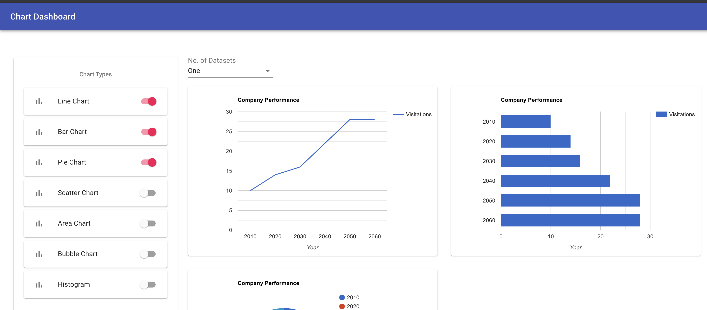

# Chart Dashboard

Chart dashboard project emulating a back-end json service and frontend reactjs powerd dashbord to render charts. when running locally you can find the project at *http://localhost:3000* address.

To install dependencies run `npm install` command
To start development server run `npm run dev` command

To build project run `npm run build` command

## App will look like:
